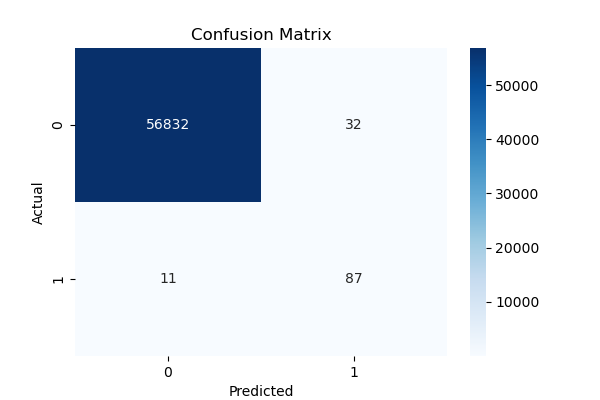
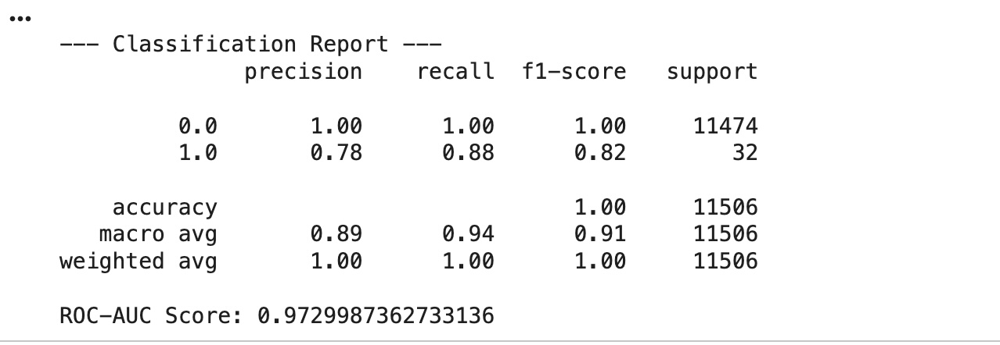
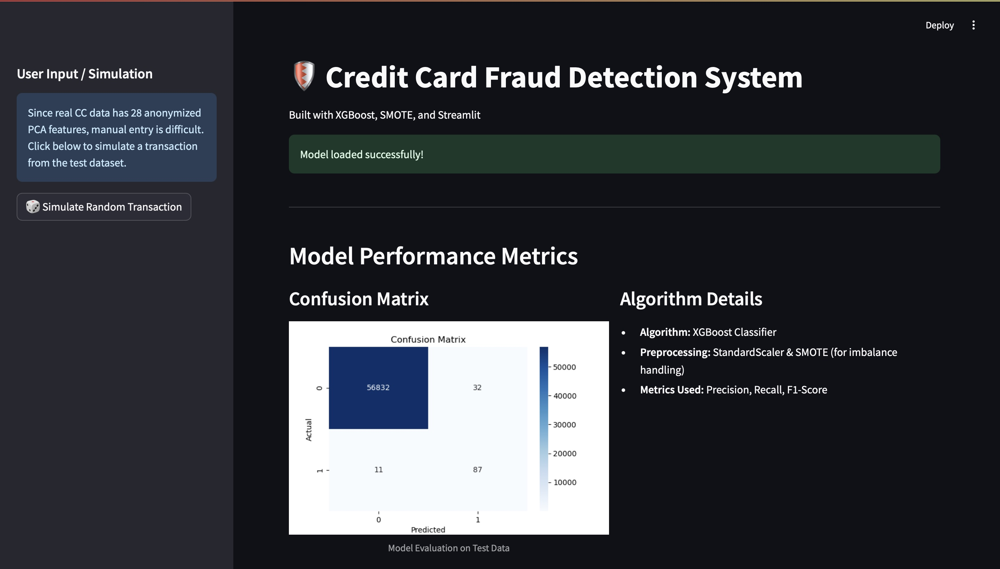
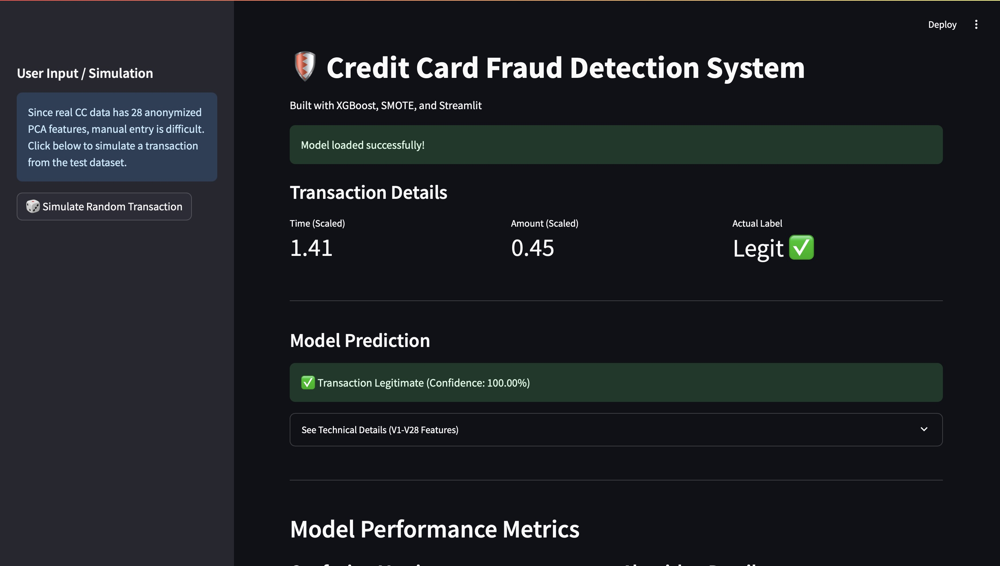
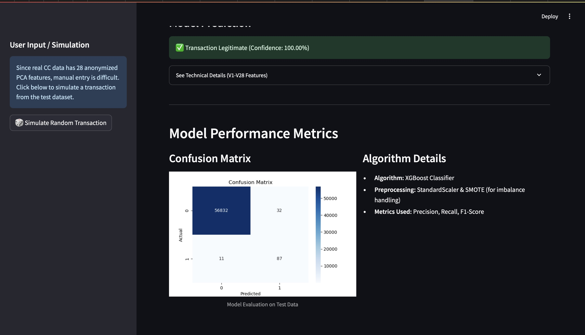

# Credit Card Fraud Detection System

A complete end-to-end machine learning project using XGBoost, SMOTE, Streamlit, and Data Visualization to detect fraudulent credit card transactions.

## Project Overview
Credit card fraud is a major challenge in the banking and financial sector.
This project builds an automated fraud detection system that:

* Trains a machine learning model using XGBoost
* Handles imbalanced data using SMOTE
* Preprocesses "Time" and "Amount" with StandardScaler
* Evaluates model using ROC-AUC, Confusion Matrix, and classification report
* Deploys a simple Streamlit web application for real-time fraud prediction
* Allows simulation of random test transactions
* Saves model artifacts for easy reusability

## Project Structure
.  
├── train_model.py  
├── ui.py  
├── credit_card.csv  
├── fraud_model.pkl   
├── scaler.pkl  
├── test_data_sample.csv  
├── test_labels_sample.csv  
├── confusion_matrix.png  
└── README.md  

## How the System Works
#### A) Training Pipeline
The training script performs the following steps:
1. Load Dataset (credit_card.csv)
2. Scale Time & Amount using StandardScaler
3. Handle Imbalanced Data using SMOTE
4. Split Data into train and test sets
5. Train XGBoost Classifier
6. Generate confusion matrix, ROC-AUC score, and classification report
7. Save model and scaler  
  fraud_model.pkl  
  scaler.pkl  
8. Export Test Samples for Streamlit app simulation  
  test_data_sample.csv  
  test_labels_sample.csv

#### B) Streamlit Web App
The Streamlit app allows you to:

* Load the saved model and test samples
* Simulate a random transaction
* Display prediction confidence
* Show feature values (V1–V28)
* Display saved confusion matrix
* Visualize model performance

## How to Run the Project
#### Step 1: Install Dependencies
*pip install -r requirements.txt*

#### Step 2: Run the Training Script
*python train_model.py*

This will generate:  
fraud_model.pkl  
scaler.pkl  
test_data_sample.csv  
test_labels_sample.csv  
confusion_matrix.png  

#### Step 3: Launch the Streamlit App
*streamlit run app.py*

The web UI will open in your browser.
Click “Simulate Random Transaction” to test fraud detection

## Model Details

**Algorithm:**	XGBoost Classifier  
**Preprocessing:**	StandardScaler (Time, Amount)  
**Imbalance Handling:**	SMOTE  
**Metrics:**	Precision, Recall, F1-score, ROC-AUC  
**Visualization:**	Confusion Matrix  

## Features of the Streamlit App
* Load trained model automatically
* Simulate random transaction
* Show prediction result with confidence score
* Fraud Alerts with icons
* Display technical feature values
* View confusion matrix
* Clean UI with CSS custom styling

## Outputs
**Confusion Matrix**

**Classification Report**

The model performs extremely well on the majority class (0) and shows strong recall on fraud cases, which is important for fraud detection.

## User Interface

